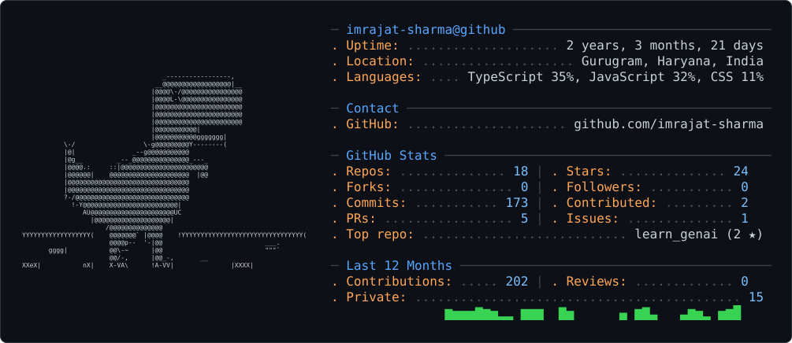

<picture>
  <source media="(prefers-color-scheme: dark)" srcset="dark_mode.svg" />
  <source media="(prefers-color-scheme: light)" srcset="light_mode.svg" />
  
</picture>

<div align="center">

<picture>
  <source media="(prefers-color-scheme: dark)" srcset="mascot-dark.gif" />
  <source media="(prefers-color-scheme: light)" srcset="mascot-light.gif" />
  
</picture>


<br/>

<a href="https://github.com/imrajat-sharma">
  
</a>
&nbsp;
<a href="https://github.com/imrajat-sharma">
  
</a>
&nbsp;


<br/><br/>


</div>

---

## `$ whoami`

```text
Rajat Sharma
──────────────────────────────────────────────

Role        → Full Stack Developer / AI Engineer
Focus       → AI Applications • LLMs • RAG • Backend Systems
Stack       → TypeScript • React • Node.js • Python
Currently   → Learning LangChain • System Design • Cloud
Mindset     → Build things that are useful.
```

---

## `$ stack`

<div align="center">
  
</div>

---

## `$ ls ~/projects`

- [`cvflight`](https://github.com/imrajat-sharma/cvflight) → polished, ATS-friendly resumes that get noticed
- [`learn_genai`](https://github.com/imrajat-sharma/learn_genai) → daily GenAI learning with LangChain & LangGraph in JS/TS
- [`ai-web-scraper`](https://github.com/imrajat-sharma/ai-web-scraper) → full-stack scraper with Google Gemini free-tier summaries
- [`skillswipe`](https://github.com/imrajat-sharma/skillswipe) → swipe to discover and connect with professionals

---

## `$ social`

<div align="center">
  <a href="https://www.linkedin.com/in/imrajat-sharma"></a>
  &nbsp;
  <a href="https://github.com/imrajat-sharma"></a>
</div>
